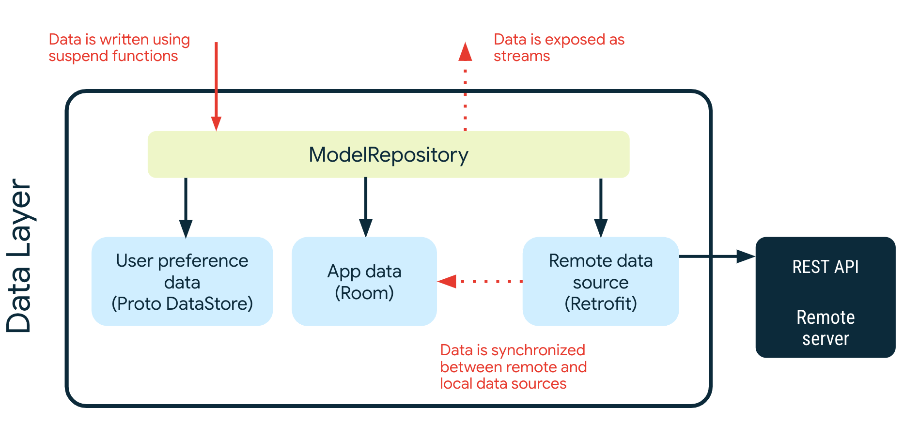
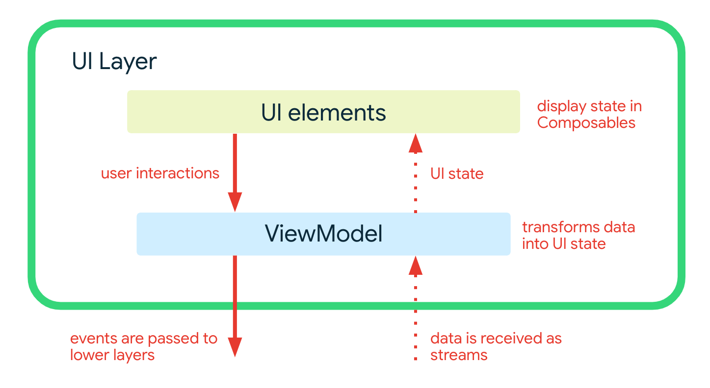

# 架构学习之路

在这段学习之旅中，你将了解Now in Android应用中的架构:它的层，关键类和它们之间的交互。

## 目标和需求

应用程序架构的目标是:

*   尽可能的遵循 [官方架构指南](https://developer.android.com/jetpack/guide).
*   易于开发人员理解，没有太实验性的内容.
*   支持多个开发人员在同一代码库上工作.
*   在开发人员的机器上和使用持续集成(CI)促进本地和仪器化测试.
*   最小化构建时间.

## 架构总述

应用程序架构有三层: [数据层](https://developer.android.com/jetpack/guide/data-layer), [逻辑层](https://developer.android.com/jetpack/guide/domain-layer) 和 [界面层](https://developer.android.com/jetpack/guide/ui-layer).

该体系结构遵循具有[单向数据流](https://developer.android.com/jetpack/guide/ui-layer#udf)的响应式编程模型。底层是数据层，关键概念是:

*   高层对低层的变化作出反应。
*   事件向下流动。
*   数据向上流动。

数据流是使用流来实现的, 使用 [Kotlin Flows](https://developer.android.com/kotlin/flow) 实现。

### 示例: 在 For You screen 上显示新闻

当应用程序第一次运行时，它将尝试从远程服务器加载新闻资源列表(当选择`prod`构建风格时，`demo`构建将使用本地数据)。 一旦加载，这些将根据用户选择的兴趣显示给他们。

下图显示了发生的事件，以及数据如何从相关对象流出以实现此目的。

下面是每一步发生的情况。 查找相关代码的最简单方法是将项目加载到Android Studio中，并在code列中搜索文本 (方便的快捷方式: 点击 <kbd>⇧ SHIFT</kbd> 两次).

<table>
  <tr>
   <td><strong>步骤</strong>
   </td>
   <td><strong>描述</strong>
   </td>
   <td><strong>代码 </strong>
   </td>
  </tr>
  <tr>
   <td>1
   </td>
   <td>应用启动, 一个同步所有数据仓库的 <a href="https://developer.android.com/topic/libraries/architecture/workmanager">WorkManager</a> job 加入队列.
   </td>
   <td><code>Sync.initialize</code>
   </td>
  </tr>
  <tr>
   <td>2
   </td>
   <td> <code>ForYouViewModel</code> 调用 <code>GetUserNewsResourcesUseCase</code> 获取带有书签保存状态的新闻资源流. 在用户和新闻存储库都发出数据之前，不会向此流发出任何数据. 在等待期间，提要状态被设置为, feed 状态被设置为 <code>Loading</code>.
   </td>
   <td>搜索 <code>NewsFeedUiState.Loading 的使用</code>
   </td>
  </tr>
  <tr>
   <td>3
   </td>
   <td>用户数据存储库从Proto DataStore支持的本地数据源获取一个<code>UserData</code>对象流。
   </td>
   <td><code>NiaPreferencesDataSource.userData</code>
   </td>
  </tr>
  <tr>
   <td>4
   </td>
   <td>WorkManager执行sync作业，该作业调用<code>OfflineFirstNewsRepository</code>开始与远程数据源同步数据。
   </td>
   <td><code>SyncWorker.doWork</code>
   </td>
  </tr>
  <tr>
   <td>5
   </td>
   <td><code>OfflineFirstNewsRepository</code> 调用 <code>RetrofitNiaNetwork</code> 使用 <a href="https://square.github.io/retrofit/">Retrofit</a> 执行实际的请求.
   </td>
   <td><code>OfflineFirstNewsRepository.syncWith</code>
   </td>
  </tr>
  <tr>
   <td>6
   </td>
   <td><code>RetrofitNiaNetwork</code> 调用远程服务器上的 REST API.
   </td>
   <td><code>RetrofitNiaNetwork.getNewsResources</code>
   </td>
  </tr>
  <tr>
   <td>7
   </td>
   <td><code>RetrofitNiaNetwork</code> 接收来自远程服务器的网络响应.
   </td>
   <td><code>RetrofitNiaNetwork.getNewsResources</code>
   </td>
  </tr>
  <tr>
   <td>8
   </td>
   <td><code>OfflineFirstNewsRepository</code> 通过插入，将远程数据 <code>NewsResourceDao</code> 同步, 更新或删除本地的 <a href="https://developer.android.com/training/data-storage/room">Room database</a>.
   </td>
   <td><code>OfflineFirstNewsRepository.syncWith</code>
   </td>
  </tr>
  <tr>
   <td>9
   </td>
   <td>当<code>NewsResourceDao</code> 中的数据发生变化时，它将被发送到新闻资源数据流中 (这是一个 <a href="https://developer.android.com/kotlin/flow">Flow</a>).
   </td>
   <td><code>NewsResourceDao.getNewsResources</code>
   </td>
  </tr>
  <tr>
   <td>10
   </td>
   <td><code>OfflineFirstNewsRepository</code> 在这个流上充当一个 <a href="https://developer.android.com/kotlin/flow#modify">中间操作符</a> , 将 <code>PopulatedNewsResource</code> (数据层内部的数据库模块) 转换为其它层可以访问的公共模块 <code>NewsResource</code>.
   </td>
   <td><code>OfflineFirstNewsRepository.getNewsResources</code>
   </td>
  </tr>
  <tr>
   <td>11
   </td>
   <td><code>GetUserNewsResourcesUseCase</code>将新闻资源列表与用户数据组合在一起，以生成新闻资源列表 <code>UserNewsResource</code>.  
   </td>
   <td><code>GetUserNewsResourcesUseCase.invoke</code>
   </td>
  </tr>
  <tr>
   <td>12
   </td>
   <td>当 <code>ForYouViewModel</code> 接收到可保存的新闻资源时，它将 feed 状态更新为 <code>Success</code>.然后，<code>ForYouScreen</code>使用状态中可保存的新闻资源来显示屏幕
   </td>
   <td>搜索 <code>NewsFeedUiState.Success</code> 的实例。
   </td>
  </tr>
</table>

## 数据层

数据层被实现为应用程序数据和业务逻辑的离线优先源。它是应用程序中所有数据的真实来源。

每个存储库都有自己的模型. 例如, `TopicsRepository` 有 `Topic` 模型、 `NewsRepository` 有 `NewsResource` 模型.

存储库是其他层的公共API，它们提供了访问应用程序数据的唯一方式。存储库通常提供一种或多种读写数据的方法

### 读取数据

数据以数据流的形式公开。这意味着存储库的每个客户机都必须准备好对数据更改做出反应。 数据不作为快照公开 (e.g. `getModel`) 因为不能保证它在使用时仍然有效。

读取从本地存储执行作为事实的来源，因此从`Repository`实例读取时不会出现错误。但是，在尝试使本地存储中的数据与远程数据源一致时，可能会出现错误。 有关错误协调的更多信息，请查看下面的数据同步部分。

_示例: 读取一个话题列表_

一个话题列表可以通过订阅 `TopicsRepository::getTopics` 流获得，该流发出 `List <Topic>` 

每当话题列表发生变化时(例如，当添加新话题时)，更新后的 `List <Topic>` 将被发送到流中。

### 写数据

为了写入数据，存储库提供了挂起函数。这取决于调用者来确保它们的执行有合适的范围。

_示例: 关注话题_

只需调用 `UserDataRepository.togglefollowwedtopicid` ，其中包含用户希望关注的话题的ID，  `following=true` 表示应该关注该话题题(使用 `false` 取消关注某个话题)。

### 数据源

存储库可能依赖于一个或多个数据源。例如， `OfflineFirstTopicsRepository` 依赖于以下数据源:

<table>
  <tr>
   <td><strong>名称</strong>
   </td>
   <td><strong>依赖</strong>
   </td>
   <td><strong>意图</strong>
   </td>
  </tr>
  <tr>
   <td>TopicsDao
   </td>
   <td><a href="https://developer.android.com/training/data-storage/room">Room/SQLite</a>
   </td>
   <td>与话题关联的持久关系数据
   </td>
  </tr>
  <tr>
   <td>NiaPreferencesDataSource
   </td>
   <td><a href="https://developer.android.com/topic/libraries/architecture/datastore">Proto DataStore</a>
   </td>
   <td>与用户首选项相关联的持久非结构化数据，特别是用户感兴趣的话题。这是使用protobuf语法在.proto文件中定义和建模的。
   </td>
  </tr>
  <tr>
   <td>NiaNetworkDataSource
   </td>
   <td>使用 Retrofit 访问远程API
   </td>
   <td>话题数据，通过REST API端点以JSON形式提供。
   </td>
  </tr>
</table>

### 数据同步

存储库负责协调本地存储与远程数据源中的数据。从远程数据源获得数据后，立即将其写入本地存储。更新后的数据从本地存储(Room)发送到相关数据流中，并由任何侦听客户端接收。

这种方法确保了应用程序的读和写关注点是分开的，不会相互干扰。

在数据同步过程中出现错误的情况下，采用指数回退策略。这是通过 `SyncWorker` 委托给 `WorkManager` ，  `Synchronizer` 接口的实现。

请参阅 `OfflineFirstNewsRepository.syncWith` 作为数据同步的示例。

## 逻辑层
 [逻辑层](https://developer.android.com/topic/architecture/domain-layer) 包含用例. 这些类只有一个包含业务逻辑的可调用方法 (`operator fun invoke`) . 

这些用例用于简化和删除 ViewModels 中的重复逻辑。它们通常组合并转换来自存储库的数据。

例如， `GetUserNewsResourcesUseCase` 将来自' `NewsRepository` '的' `NewsResource` '的流(使用' `Flow` '实现)与来自' `UserDataRepository` '的' `UserData` '对象流结合起来创建' `UserNewsResource` '的流。这个流被各种 ViewModels 用来在屏幕上显示带有书签状态的新闻资源。 

值得注意的是，Now in Android 中的逻辑层(目前)_不包含_任何事件处理的用例。事件由UI层直接调用存储库上的方法来处理。

## 界面层

[界面层](https://developer.android.com/topic/architecture/ui-layer) 包括:

*   使用 [Jetpack Compose](https://developer.android.com/jetpack/compose) 构建的界面元素
*   [Android ViewModels](https://developer.android.com/topic/libraries/architecture/viewmodel)

ViewModels从用例和存储库接收数据流，并将它们转换为UI状态。UI元素反映了这种状态，并为用户提供了与应用交互的方式。这些交互作为事件传递给ViewModel，在那里它们被处理。

### UI状态建模

UI状态被建模为使用接口和不可变数据类的密封层次结构。状态对象只能通过数据流的转换发出。这种方法确保:

*   UI状态总是代表底层的应用数据——应用数据是事实的来源。
*   UI元素处理所有可能的状态。

**示例: 新闻提要 在 For You screen**

For You screen 上的新闻资源提要(列表)使用 `NewsFeedUiState` 建模。这是一个密封接口，它创建了两种可能状态的层次结构:

*   `Loading` 表示数据正在加载
*   `Success` 表示数据已成功加载. Success状态包含新闻资源列表.

 `feedState` 被传递给 `ForYouScreen` , 它处理这两个状态。

### 将流转换为UI状态

从一个或多个用例或存储库接收作为冷流 [flows](https://kotlin.github.io/kotlinx.coroutines/kotlinx-coroutines-core/kotlinx.coroutines.flow/-flow/index.html) 的数据流. 它们被 [组合](https://kotlin.github.io/kotlinx.coroutines/kotlinx-coroutines-core/kotlinx.coroutines.flow/combine.html) 在一起，或简单的 [映射](https://kotlinlang.org/api/kotlinx.coroutines/kotlinx-coroutines-core/kotlinx.coroutines.flow/map.html), 生成单个UI状态流. This single flow is 然后使用 [stateIn](https://kotlin.github.io/kotlinx.coroutines/kotlinx-coroutines-core/kotlinx.coroutines.flow/state-in.html)转换成热流. 到状态流的转换使UI元素能够从流中读取最后一个已知状态。

**示例: 显示关注的话题**

 `InterestsViewModel` 将 `uiState` 暴露为 `StateFlow<InterestsUiState>`. 这个热流是通过获取由 `GetFollowableTopicsUseCase` 提供的`List<FollowableTopic>` 创建的. 每次发出一个新列表时，它都会被转换为一个 `InterestsUiState.Interests` 状态，提供给 UI.

### 处理用户交互

用户操作通过常规的方法调用从UI元素传递到 ViewModels。这些方法作为lambda表达式传递给UI元素。

**示例: 关注一个话题**

 `InterestsScreen` 接受一个名为 `followTopic` 的lambda表达式，该表达式由 `InterestsViewModel.followTopic` 提供。每次用户点击一个话题进行关注时，都会调用这个方法。然后ViewModel通过通知用户数据存储库来处理此操作。

## 延伸阅读

[Guide to app architecture](https://developer.android.com/topic/architecture)

[Jetpack Compose](https://developer.android.com/jetpack/compose)
